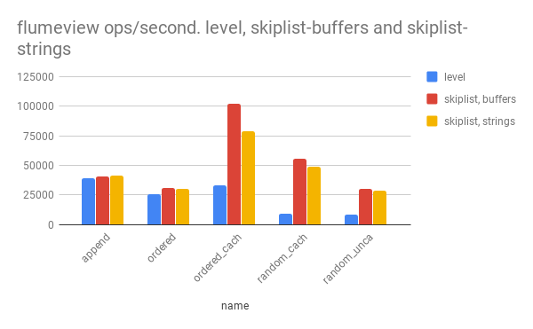

# flumeview-skiplist

A flumeview based on my new [skiplist-buffer](https://github.com/dominictarr/skiplist)

_another step in the continuing quest to write a fast embedded database in javascript_

This is a strictly in-memory index. You wouldn't actually use this on it's own,
(because you'd want to persist the indexes, rather than rebuild them each time)
But I wrote this because I wanted to compare performance of my skiplist with level.

Level also contains a skiplist, which is why I chose this algorithm.

the skiplist is better, or nearly as good as level!

## License

MIT

